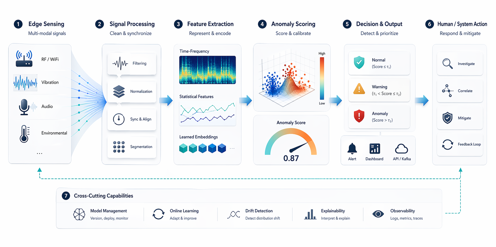

<p align="center">
  
</p>

<h1 align="center">GPT Imagen</h1>
<p align="center">A Claude Code plugin that gives Claude the ability to generate and edit images using GPT Image 2.</p>

<p align="center">
  <a href="LICENSE"></a>
  
  
  
  
  <a href="https://platform.openai.com/docs/models/gpt-image-2"></a>
</p>

## Install

In Claude Code:

```
plugin marketplace add aymenbouferroum/gpt-imagen
plugin install gpt-imagen@gpt-imagen
/reload-plugins
```

Then use any of the five included skills:

```
/gpt-imagen  /frontend-mockup  /game-asset-lab  /paper-figure-visual  /image-edit-studio
```

> Full provider setup and local dev install: [docs/INSTALL.md](docs/INSTALL.md)

## Skills

| Skill | What it does |
|-------|-------------|
| `/gpt-imagen` | General-purpose image generation and editing |
| `/frontend-mockup` | Landing pages, dashboards, product heroes, app store screenshots |
| `/game-asset-lab` | Sprites, props, icons, key art, and stylized game visuals |
| `/paper-figure-visual` | Conceptual research figures, pipeline diagrams, cover-style paper art |
| `/image-edit-studio` | Background removal, restyling, compositing, and reference-driven edits |

## Examples

<table>
<tr>
<td align="center" width="50%">
<br>
<strong>/frontend-mockup</strong> — Dashboard hero
</td>
<td align="center" width="50%">
<br>
<strong>/game-asset-lab</strong> — Fantasy inventory icons
</td>
</tr>
<tr>
<td align="center" width="50%">
<br>
<strong>/paper-figure-visual</strong> — Pipeline concept figure
</td>
<td align="center" width="50%">
<br>
<strong>/gpt-imagen</strong> — Product render
</td>
</tr>
</table>

## How it works

1. **You describe what you need** — a landing page hero, a game icon set, a paper figure, or an edit to an existing image.
2. **Claude refines your request** — it reads your repo context and structures a vague ask into a visual prompt.
3. **GPT Image 2 generates the image** — via the OpenAI Images API (direct) or through Codex CLI (convenience path).
4. **The result lands in your workspace** — saved as a timestamped PNG, ready for iteration.

Claude handles orchestration and prompt refinement. GPT Image 2 handles pixels.

## Configuration

GPT Imagen supports two provider paths:

| Provider | Setup | Best for |
|----------|-------|----------|
| **OpenAI API** (default) | Set `openai_api_key` in plugin config or `OPENAI_API_KEY` env var | Full GPT Image 2 control, mask-based edits |
| **Codex CLI** | Have `codex` installed and logged in | Zero-config convenience for existing Codex users |

The plugin uses `auto` mode by default: tries Codex first, falls back to the API.

> Full configuration options: [docs/INSTALL.md](docs/INSTALL.md)

## Documentation

| Doc | Description |
|-----|-------------|
| [Install Guide](docs/INSTALL.md) | Provider setup, local dev install, configuration reference |
| [Tutorial](docs/TUTORIAL.md) | Step-by-step examples for each skill |
| [Capabilities](docs/CAPABILITIES.md) | What GPT Imagen can and cannot do |
| [Contributing](CONTRIBUTING.md) | Development workflow and release process |
| [Changelog](CHANGELOG.md) | Version history |
| [Acknowledgments](ACKNOWLEDGMENTS.md) | Credits |

## License

[MIT](LICENSE)
